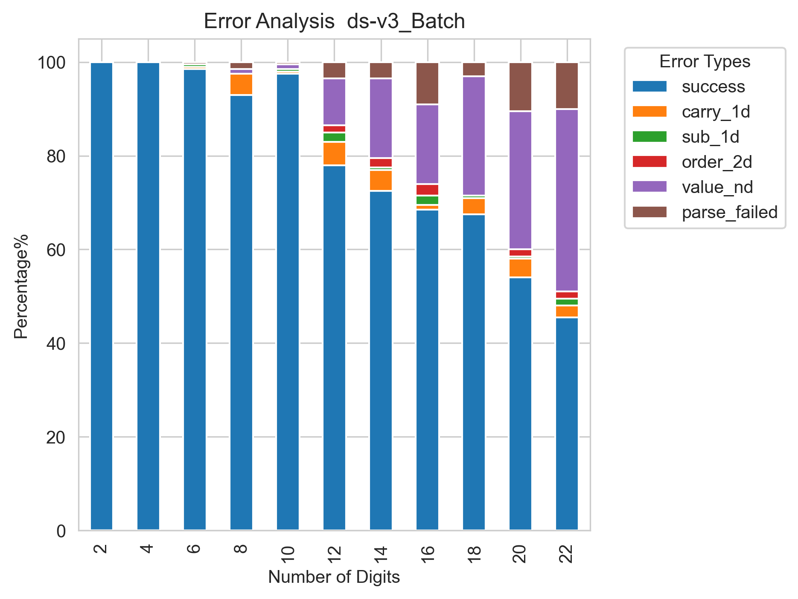
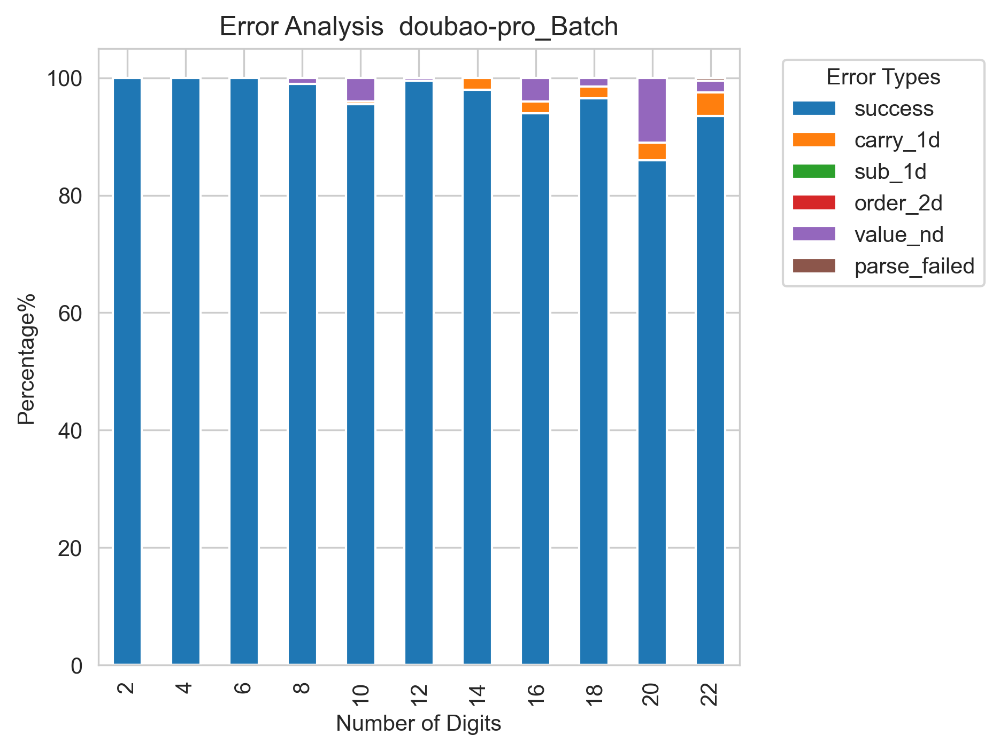

# 测试大模型的基础计算能力

## 目的：  
本研究基于无进位加法这一特殊运算场景，构建系统性评估框架，旨在实现以下研究目标：

误差隔离：通过设计无进位约束条件，将计算错误与进位幻觉进行解耦分析

错误溯源：建立多维度错误分类体系，尝试分析模型计算失效的内在机制

能力评估：量化模型对数值表征的鲁棒性，探索数字长度与计算准确率的关联规律

## 流程： 
#### 1 测试集构建

自动化生成工具开发  
python random 模块  
约束：无进位  
范围：2-22位  
    

测试样例设计：
- 多位无进位数字加法计算   
  由于所有数字都不会产生进位，所以进位都是错误的，可能和幻觉有关。  
  
数据规模：每层200个样例

data_create.py
------------
#### 2 实验方案执行，

标准化测试流程：
- 温度为0，
- 统一prompt模板  
    systemp_prompt = ''  
    user_prompt = 列竖式计算表达式的值，计算结果放 \boxed{} 中，例如结果为2, 写成 \boxed{2}。表达式:20+64  

- 超时和重试  
     火山引擎 批量推理，超时时间设定30分钟，response code为 500和429 则等待60s后重试。
- 答案提取: 
     使用正则表达式从boxed{}中提取最终答案  

- 字符解析错误的处理    
     没有提取到答案的，按解析错误处理，记录parse error。数据单独写入到error文件。  
    

- 错误标注   
   按实际计算值和目标值的差，判断是否正确  
   生成字符的比较，把有差异的数字分割开来：   
   计算值：97899-87-98297  
   目标值：97899-78-98297 

-------------------
#### 3 数据分析

错误类型标注体系  

根据错误涉及的位数多少进行如下分类: 

- 单个进位错误 （carray_1d）  
  计算值：8-900    
  目标值：8-899  
  检测方法： 0< diff_part <9   &&  只有一处不同，字符集合不同
- 单数字符错误  (sub_1d)    
  计算值: 876287-7-458  
  目标值：876287-9-458  
  检测方法： -9< diff_part < 0  
- 两位数字顺序错误 (order_2d)   
  计算值：97899-87-98297
  目标值  97899-78-98297  
  检测方法：  只有一处不同，字符集合相同且长度两位    
- 多位计算错误  (value_nd)  
  计算值：76-816-619   
  目标值：76-789-619   
  检测方法： 其他情况，一般涉及多出不同，字符差异较大。实际分析数据发现，一般都出现错误的对齐。  

增加过程验证：    
分析数据发现，存在中间计算正确，但模型最终还是给错误答案的情况。  
检测方法： 判断计算结果是否在答案或者推理过程中出现：    
  
------------
#### 4 结果分析
- 不同模型随数字长度变化，其计算准确度的变化。初步看doubao-pro表现最好。
  

- 不同模型错误类型区别   
   不同类型，主要错误都集中在，单个位的进位幻觉carry_1d，以涉及多个位计算错误  value_nd

  
  
  
   
           超出了token阈值，被截断了，导致解析不到结果 \boxed{result} 
   
           r1中还出现了，连续两位数顺序错误，order_2d
  

- 过程验证发现 
   在ds-v3 和ds-r1的错误数据中发现了，中间过程中出现了正确答案，即其实际有计算正确过,却并未被采纳。
   这个现象基本在本实验中的其他模型中几乎没有出现。 
  

---------------
#### 关于代码

data sample数据和模型问答数据  

result 是结果图片  

data_create.py 数据创建模块  

llm.py 大模型接口

eval_answer.py 问答执行和记录模块

error_sort.py 错误数据分析模块

result_show.py 不同模型准确度绘图  

#### 想法来源

知乎话题  
[LLM（大语言模型）无法对数字进行准确运算的底层原因是什么？ - 张俊林的回答 - 知乎](https://www.zhihu.com/question/654932431/answer/3522356508)